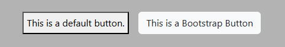
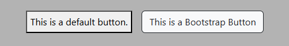
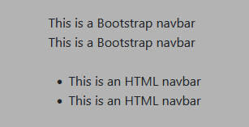
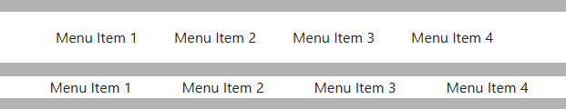
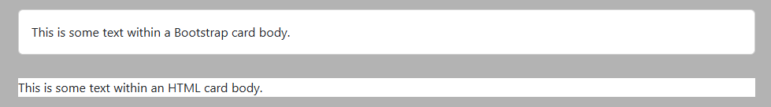
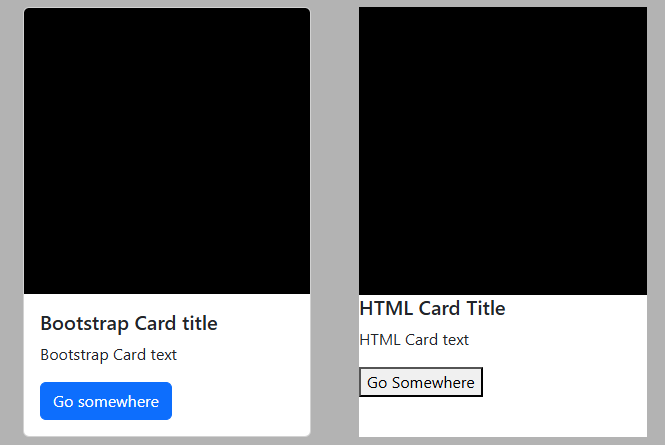
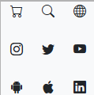
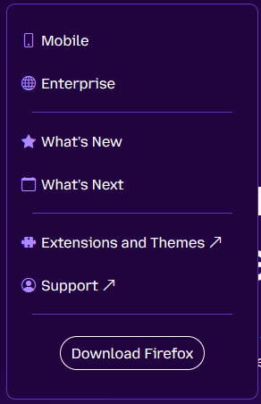
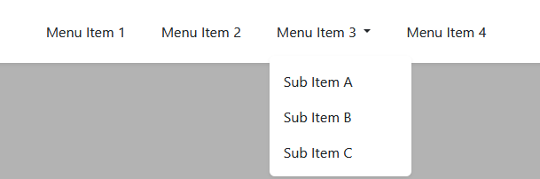
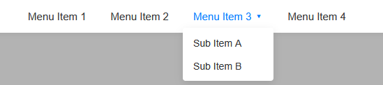

## Introduction

To quote my own essay, <a href="https://tayten0.github.io/essays/typescript.html" target="_blank">"TypeScript: It Does What JavaScript Does—But Better!"</a>: "HTML is a language used to create the elements you see on a website," while "CSS is the language used to style your website." If you've ever used the internet, you've interacted with these two languages before. Every website is built using a combination of HTML and CSS, whether it was made from scratch or using a website builder like Wix or Squarespace. Most people who need a website will probably opt to use a website builder. They're simple to use and easy to learn, so it's pretty reasonable to put together a decent-looking website without putting too much time into it. But for those with programming experience, making a website from scratch provides a level of style and functionality customization that no website builder can match. Unfortunately, making a website from scratch is a lot of work. Not only do you have to create all the elements and containers that will hold your content, you have to manually style each and every one of them—creating who knows how many different classes and tinkering with them to reach that perfect look. If only there was a way to make this process simpler.  

Well, there is. In fact, that's exactly what UI frameworks are for.

## Coding and Legos

  
<caption><small>
  Figure 1: A picture of the Pick-A-Brick wall at the an unspecified Disneyland.<br>
  <em>Source: <a href="https://www.reddit.com/r/lego/comments/43q0s6/the_pick_a_brick_wall_at_the_lego_store_at/" target="_blank">u/Bike-Mechanic-Man, Reddit.com</a></em>
</small></caption>  

To understand what UI frameworks are, we can think of them in terms of Lego bricks. Imagine your website as a house that you want to build. Building your website from scratch is akin to manually designing and creating each individual Lego brick you use to make that house—the size, shape, color, and every other attribute of every single brick. This is, of course, a lot of work, but it grants you unlimited flexibility in how you build. In comparison, using a UI framework is like going to a Lego store and sourcing your bricks from their Pick-a-Brick wall. There's a wide variety of bricks and pieces that have already been designed and manufactured, and you can simply use those parts to build your house. In the event that they don't have a brick that perfectly suits your needs, you can still create your own or modify an existing one. Ultimately, UI frameworks are meant to save you the time and effort of building every component of your website from scratch, allowing you to focus on the fine-tuning and styling to make it your own. There are countless UI frameworks in widespread use across the internet, but the one I want to focus on today is called Bootstrap.

## You Need to Strap on Your Boots

  
<caption><small>
  Figure 2: The official Bootstrap logo.<br>
  <em>Source: <a href="https://getbootstrap.com/docs/5.0/about/brand/" target="_blank">Bootstrap</a></em>
</small></caption>  

Bootstrap is one of the most popular UI frameworks in use today. First created by developers at Twitter in 2011, it has evolved into an open-source framework that packs classes for CSS styling and JavaScript functionality into one massive library that you can use to build your website. There's not much else to say that hasn't been covered in the previous section, so let's jump straight into how you can use Bootstrap for your own projects and look at some examples.

### How do I Strap on my Boots?

To use Bootstrap in your own project, all you have to do is add these two lines of code to your HTML file:
```html
<link href="https://cdn.jsdelivr.net/npm/bootstrap@5.3.8/dist/css/bootstrap.min.css" rel="stylesheet" integrity="sha384-sRIl4kxILFvY47J16cr9ZwB07vP4J8+LH7qKQnuqkuIAvNWLzeN8tE5YBujZqJLB" crossorigin="anonymous">
<script src="https://cdn.jsdelivr.net/npm/bootstrap@5.3.8/dist/js/bootstrap.bundle.min.js" integrity="sha384-FKyoEForCGlyvwx9Hj09JcYn3nv7wiPVlz7YYwJrWVcXK/BmnVDxM+D2scQbITxI" crossorigin="anonymous"></script>
```
These lines import Bootstrap's library into your website, making all of its classes and styles immediately available for you to use. Now that we have everything set up, let's take a look at what it can actually do.

### What Kind of Work can my Boot Straps do?

Instead of a full Bootstrap tutorial, we’ll look at a few basic examples of common website elements to give you a feel for how the framework works. To really show the contrast, I'll also include the standard HTML and CSS counterparts for each example.

#### Buttons

Buttons serve a variety of purposes, from submitting information and downloading files to navigating to a different page.

  
<caption><small>
  Figure 3: A basic HTML button on the left and a Bootstrap button on the right.
</small></caption>  

```html
<button>This is a default button.</button>
<button class="btn bg-light">This is a Bootstrap Button</button>
```
Bootstrap buttons feature rounded corners and no borders. It’s a sleek design that feels right at home on a modern website, whereas the rectangular, thick-bordered default HTML button feels like a relic from the early 2000s. Bootstrap buttons also include custom styling for their active state. 


<caption><small>
  Figure 4: A basic HTML button on the left and an active Bootstrap button on the right.
</small></caption>  

As you can see, Bootstrap buttons smoothly transition to a bordered state when clicked, providing a subtle indicator that confirms the user's action. Standard HTML, on the other hand, simply swaps the colors of the borders; the top and left borders switch with the bottom and right. While this can be hard to spot, the top and left edges use a shade of gray, while the bottom and right are solid black. These colors swap when the button is active.

#### Navbars

Navbars provide users with a simple and intuitive way to access the different pages on your website.


<caption><small>
  Figure 5: A Bootstrap navbar on the top and a basic HTML navbar on the bottom.
</small></caption>  

```html
<nav class="navbar">
    <ul class="navbar-nav">
        <li>This is a Bootstrap navbar</li>
        <li>This is a Bootstrap navbar</li>
    </ul>
</nav>
<nav>
    <ul>
        <li>This is an HTML navbar</li>
        <li>This is an HTML navbar</li>
    </ul>
</nav>
```
At their core, navbars are just unordered lists. You can see that with Bootstrap, it automatically removes the bulletpoints. With a few more classes, we can make these both into the horizontal navbars you typically see on websites.


<caption><small>
  Figure 6: A styled Bootstrap navbar on the top and a styled HTML navbar on the bottom.
</small></caption>  

```html
<!-- The Bootstrap Navbar -->
<nav class="navbar navbar-expand-lg navbar-light bg-white">
    <div class="container justify-content-center">
        <ul class="navbar-nav d-flex flex-row gap-4">
            <li class="nav-item"><a class="nav-link text-dark">Menu Item 1</a></li>
            <li class="nav-item"><a class="nav-link text-dark">Menu Item 2</a></li>
            <li class="nav-item"><a class="nav-link text-dark">Menu Item 3</a></li>
            <li class="nav-item"><a class="nav-link text-dark">Menu Item 4</a></li>
        </ul>
    </div>
</nav>

<!-- The HTML Navbar -->
<nav style="background-color: white;">
    <ul style="display: flex; flex-direction: row; justify-content: center; list-style: none; gap: 55px;">
        <li><a>Menu Item 1</a></li>
        <li><a>Menu Item 2</a></li>
        <li><a>Menu Item 3</a></li>
        <li><a>Menu Item 4</a></li>
    </ul>
</nav>
```
You can see that in the Bootstrap navbar, the items are evenly spaced between themselves and the edges. There's also some spacing between the navbar items and the top and bottom to prevent it from feeling too claustrophobic.

#### Cards

Cards are containers on a website that display content and actions about a single topic. They're meant to be an easy for a user to scan for relevant and useful information.


<caption><small>
  Figure 7: A basic Bootstrap card on the top and a basic HTML card on the bottom.
</small></caption>  

```html
<div class="card">
    <div class="card-body">
        This is some text within a Bootstrap card body.
    </div>
</div>

<div style="background-color: white;">
    This is some text within an HTML card body.
</div>
```
Looking at the image above, you can see that the most basic container in HTML is just a <div> tag. By adding Bootstrap's basic card classes, that <div> gets some internal padding to push the text away from the edges and make it way easier to read. It also adds rounded corners for a smoother, more modern look. Cards aren't just used to hold text, though.


<caption><small>
  Figure 8: A Bootstrap card on the top and an HTML card on the bottom, both with an image, a title, some text, and a button.
</small></caption>  

```html
<div class="card" style="width:18rem;">
    
    <div class="card-body">
        <h5 class="card-title">Bootstrap Card title</h5>
        <p class="card-text">Bootstrap Card text</p>
        <a href="#" class="btn btn-primary">Go somewhere</a>
    </div>
</div>

<div style="background-color: white; width: 18rem;">
    
    <h5>HTML Card Title</h5>
    <p>HTML Card text</p>
    <button>Go Somewhere</button>
</div>
```

Cards can hold pretty much anything, from text and images to buttons. Bootstrap automatically adds spacing between all these elements for you, and it even rounds the corners of the card components to match.

### My Boot's Straps Have Icons

Bootstrap goes beyond just styled HTML components. By adding this one extra line of code:

```html
<link rel="stylesheet" href="https://cdn.jsdelivr.net/npm/bootstrap-icons@1.11.3/font/bootstrap-icons.min.css">
```
You gain access to Bootstrap's library of over 2,000 icons.


<caption><small>
  Figure 9: Bootstrap icons from left to right, top to bottom: Cart, Search, Globe, Instagram, Twitter, Youtube, Android 2, Apple, Linkedin.
</small></caption>  

```html
<i class="bi bi-cart"></i>
<i class="bi bi-search"></i>
<i class="bi bi-globe"></i>
<i class="bi bi-instagram"></i>
<i class="bi bi-twitter"></i>
<i class="bi bi-youtube"></i>
<i class="bi bi-android2"></i>
<i class="bi bi-apple"></i>
<i class="bi bi-linkedin"></i>
```
To add them to your website, all you have to do is visit the official <a href="https://icons.getbootstrap.com/" target="_blank">Bootstrap Icons</a> site, choose the icon you want, and then copy and paste the code for its web font. It's as simple as 1, 2, 3! Plus, because these icons are treated just like fonts, you can easily style them with CSS.


<caption><small>
  Figure 10: Dropdown menu from a recreation of the Firefox website I made using Bootstrap.
</small></caption>  

In this screenshot, each icon on the left-hand side—as well as the upper-right arrows next to 'Extensions and Themes' and 'Support'—are Bootstrap icons. They've been styled with the color ```#ae89ff```. Super simple to use for all kinds of projects, Bootstrap icons are a great way to add those perfect finishing touches to your website.

## Do Bootstrap's Classes Outclass Classifying Your Own Classes?

  
<caption><small>
  Figure 11: A man thinking,<br>
  <em>Source: <a href="https://www.istockphoto.com/photo/pensive-thoughtful-contemplating-caucasian-young-man-thinking-about-future-planning-gm1388645967-446222427" target="_blank">iStock by Getty Images</a></em>
</small></caption>  

So, I've spent a lot of time talking about all the things Bootstrap can do and why it's so great, which probably makes you think I'm a huge fan, right? Well, for the past week, we've actually been working with it in class. We practiced making navbars, dropdown menus, cards, and footers, which all culminated in us recreating a website of our choice using the Bootstrap library. After all of that, I can confidently say that I'm not really a fan. Sure, I can definitely see the utility, but I have two main issues with the framework.

### 1. Oh God, it's Hideous

To put it simply, working with Bootstrap creates what in my opinion is absolutely hideous code. Take this navbar for example:


<caption><small>
  Figure 12: A navbar with a dropdown menu made in Bootstrap.
</small></caption>  

It's a nice, simple navbar with 4 menu items and a single dropdown menu. Let's take a look at how it's made.
```html
<nav class="navbar navbar-expand navbar-light bg-white py-3 shadow-sm">
    <div class="container justify-content-center">
        <ul class="navbar-nav d-flex flex-row align-items-center gap-4">
            <li class="nav-item">
                <a class="nav-link text-dark fw-medium" href="#">Menu Item 1</a>
            </li>
            <li class="nav-item">
                <a class="nav-link text-dark fw-medium" href="#">Menu Item 2</a>
            </li>
            
            <li class="nav-item dropdown">
                <a class="nav-link text-dark fw-medium dropdown-toggle" href="#" role="button" data-bs-toggle="dropdown" aria-expanded="false">
                Menu Item 3
                </a>
                <ul class="dropdown-menu shadow-sm border-0 mt-2">
                    <li><a class="dropdown-item py-2" href="#">Sub Item A</a></li>
                    <li><a class="dropdown-item py-2" href="#">Sub Item B</a></li>
                    <li><a class="dropdown-item py-2" href="#">Sub Item C</a></li>
                </ul>
            </li>
            <li class="nav-item">
                <a class="nav-link text-dark fw-medium" href="#">Menu Item 4</a>
            </li>
        </ul>
    </div>
</nav>
```
Every single HTML element is packed with a string of classes, and the hierarchy structure is pretty unusual. Everything is wrapped in a ```<nav>``` tag, which makes sense since it’s a navbar. But then there’s a ```<div>``` tag right inside it that <em>also</em> encompasses all the navbar elements. In my opinion, it’s strange to put a container element inside another container element, but a lot of Bootstrap components work this way. With that in mind, let’s take a look at what this navbar would look like if it were made purely with standard HTML and CSS.


<caption><small>
  Figure 13: A navbar with a dropdown menu made purely with HTML and CSS.
</small></caption>  

```html
<nav class="site-nav">
    <ul class="menu">
        <li><a href="#">Menu Item 1</a></li>
        <li><a href="#">Menu Item 2</a></li>
        <li class="has-sub">
        <a href="#">Menu Item 3 ▾</a>
        <ul class="sub-menu">
            <li><a href="#">Sub Item A</a></li>
            <li><a href="#">Sub Item B</a></li>
        </ul>
        </li>
        <li><a href="#">Menu Item 4</a></li>
    </ul>
</nav>
```
Doesn't that look much cleaner? Ignoring the fact that I forgot to add a third item in the dropdown menu, there are only four different classes used to achieve a near identical navbar. Additionally, the hierarchy structure is much more intuitive. The ```<nav>``` serves as a container, and the only things inside it are the navbar items themselves. "But Tayten, this isn't a fair comparison. I don't know what your classes even do." Fair point, and that brings me to my next issue with Bootstrap: readability.

### 2. How are These Classes Classified?

Let's take at the pure HTML and CSS code again.
```html
<nav class="site-nav">
    <ul class="menu">
        <li><a href="#">Menu Item 1</a></li>
        <li><a href="#">Menu Item 2</a></li>
        <li class="has-sub">
        <a href="#">Menu Item 3 ▾</a>
        <ul class="sub-menu">
            <li><a href="#">Sub Item A</a></li>
            <li><a href="#">Sub Item B</a></li>
        </ul>
        </li>
        <li><a href="#">Menu Item 4</a></li>
    </ul>
</nav>
```
What do each of these classes do? To find out, all we have to do is look behind the curtains in the ```style.css``` file.
```html
.site-nav { 
    background: #fff;
    padding: 12px 0;
    box-shadow: 0 2px 8px rgba(0,0,0,0.06);
    font-family: sans-serif;
}

.menu {
    display: flex;
    justify-content: center; 
    list-style: none; 
    gap: 35px; 
    margin: 0; 
    padding: 0; 
}

.menu a {
    color: #333;
    text-decoration: none;
    font-weight: 500;
    font-size: 15px;
}

.menu a:hover { 
    color: #007bff; 
}

.has-sub { 
    position: relative; 
}

.sub-menu { 
    display: none; 
    position: absolute; 
    top: 100%; 
    left: 50%; 
    transform: translateX(-50%); 
    background: #fff; 
    min-width: 130px; 
    box-shadow: 0 4px 12px rgba(0,0,0,0.1); 
    border-radius: 4px; 
    list-style: none; 
    padding: 5px 0; 
    margin-top: 5px; 
}

.sub-menu a { 
    display: block; 
    padding: 6px 15px; 
    font-size: 14px; 
}

.sub-menu a:hover { 
    background: #f8f9fa; 
}

.has-sub:hover .sub-menu { 
    display: block; 
}
```
You're probably thinking, "That's way more code than the Bootstrap navbar. Why is this better?" And the answer to that, is because I can see <em>exactly</em> what each class does. Let's take another look at the Bootstrap code.
```html
<nav class="navbar navbar-expand navbar-light bg-white py-3 shadow-sm">
    <div class="container justify-content-center">
        <ul class="navbar-nav d-flex flex-row align-items-center gap-4">
            <li class="nav-item">
                <a class="nav-link text-dark fw-medium" href="#">Menu Item 1</a>
            </li>
            <li class="nav-item">
                <a class="nav-link text-dark fw-medium" href="#">Menu Item 2</a>
            </li>
            
            <li class="nav-item dropdown">
                <a class="nav-link text-dark fw-medium dropdown-toggle" href="#" role="button" data-bs-toggle="dropdown" aria-expanded="false">
                Menu Item 3
                </a>
                <ul class="dropdown-menu shadow-sm border-0 mt-2">
                    <li><a class="dropdown-item py-2" href="#">Sub Item A</a></li>
                    <li><a class="dropdown-item py-2" href="#">Sub Item B</a></li>
                    <li><a class="dropdown-item py-2" href="#">Sub Item C</a></li>
                </ul>
            </li>
            <li class="nav-item">
                <a class="nav-link text-dark fw-medium" href="#">Menu Item 4</a>
            </li>
        </ul>
    </div>
</nav>
```
We can determine what some of the classes do just by looking at their names. ```bg-white``` sets the background color to white, and ```text-dark``` sets the font color to black. ```justify-content-center``` and ```align-items-center``` are almost word-for-word the same as ```justify-content: center;``` and ```align-items: center;``` in traditional CSS, centering the contents horizontally and vertically, respectively.  

But after that, we begin to move into more obscure names. For instance, you can probably guess that ```d-flex``` is shorthand for ```display: flex;``` in traditional CSS. From obscure names, we move into vague styling. ```py-2``` adds vertical padding, but how much exactly? Bootstrap uses a scale from 0 to 5, but how much padding does each level actually add? ```fw-medium``` adjusts the font weight of the text, but by how much? The same issue applies to ```gap-4``` and ```shadow-sm```—I have a general idea of what they do, but I'm left in the dark about the specifics.  

Finally, there are the "black box" classes. What exactly does ```navbar``` do? Or ```container```? ```nav-link```, ```nav-item```, and ```dropdown-item``` aren't exactly giving away many hints either.

It's the lack of code readability that bothers me. Ugly code? I can tolerate that. Hell, I have to work with it every day. But if I can't understand your code and what it does just by reading it, then in my opinion, your code isn't very good. 

### Will I Strap on My Boots?

Overall, while I can see the utility Bootstrap provides, I just don't see myself using it in my professional career. The unconventional structural hierarchy makes designing certain elements, like navbars, a headache. On top of that, the vague nature of the classes makes it hard to tell if their built-in attributes conflict with other elements up or down the DOM tree. As the final nail in the coffin, the sheer number of classes to memorize in the Bootstrap library means I don't see why I would spend time looking up a class to do what I want when I can simply write it myself. In my current role, we build our CSS classes from the ground up—I've grown quite comfortable with that workflow, so I think I'll stick to what feels best to me.

## Conclusion

At the end of the day, we're all free to program as we see fit. Some people like to build their projects from the ground up, others like to modify existing components, and some like to use as many premade components as possible and do the bare minimum. For those in the latter two camps, UI frameworks like Bootstrap are perfect.  

Even though I clowned on it a bit, Bootstrap is by no means a get-out-of-jail-free card for building a website. It's still something you need to learn. There are hundreds, if not thousands, of classes stored in Bootstrap's library, and it takes time to learn them all and understand how they interact with each other.  

But like everything else in software development, Bootstrap is simply another tool in your devkit. You can use it if you want, or you can choose a different tool altogether. Every tool in the toolbox has its purpose—and if you put in the time and effort to master this one, you can create great things with it.  

<hr>
<em>This essay was grammar checked using Google Gemini 3.5<br>
All images belong to their respective copyright holder.</em>