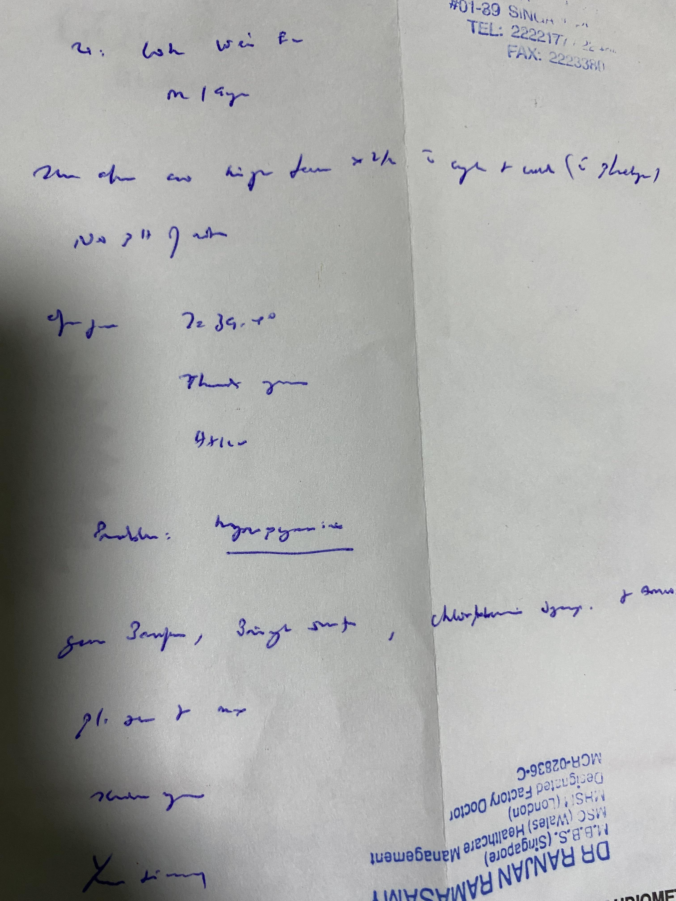
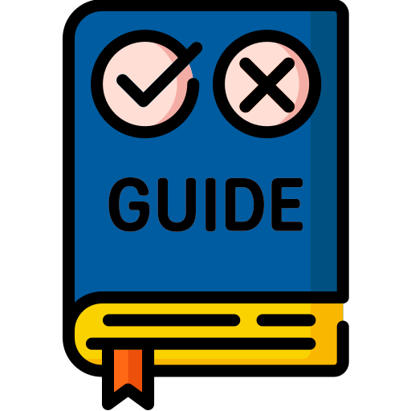
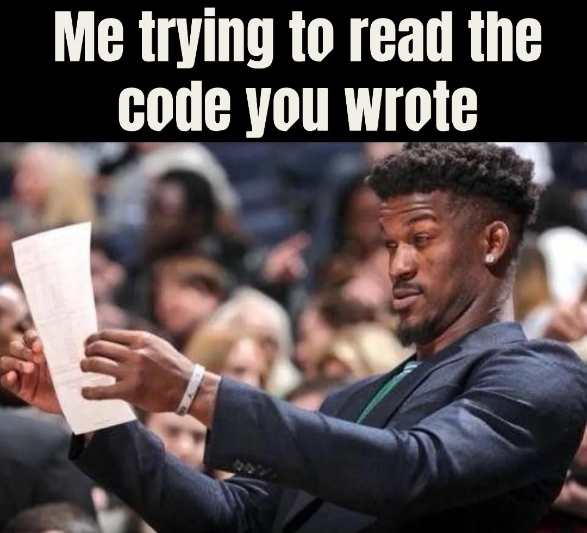

## Introduction

Everyone knows how to write; it's one of the first things we're taught in school. It starts out rough as we learn how to physically form letters. Then, we learn how to put those characters together into words, then sentences, and how to derive meaning from them. Our handwriting starts out messy—crude, oversized letters drawn with lines about as straight as wet spaghetti and bleeding into the lines above and below. Over time, it improves. From there, we naturally develop our own unique style as we subconsciously adjust our strokes to be faster and more efficient. The most extreme version of this is found in a doctor's scribble, as they utilize a quick, barely legible handwriting combined with medical shorthand to process patients as quickly as possible. However, while their style is highly efficient for them, the sheer illegibility of a doctor's handwriting has become a universal joke.  

  
<i>Figure 1: A picture of a doctor's note. Source: [u/nehyolaw, Reddit.com](https://www.reddit.com/r/Handwriting/comments/k0vdbd/is_anyone_able_to_decipher_this_literal_doctors/)</i>  

Coding is similar. Learning the syntax is like learning the alphabet. Functions and algorithms are akin to sentences, while programs are akin to essays. The way we write code—how we name variables, how we structure our logic, what data structures and methods we use—can be thought of as our handwriting. In this case, a doctor's handwriting is the equivalent of terribly messy code: uninformative variable and function names, inconsistent spacing, and cramming several actions into a single line. These are practices that, while syntactically valid, make the code difficult, if not impossible, for anyone but its creator to read. So, how do we stop people from writing such terrible code? Well, that's where coding standards come in.

## How do we Know What Is and Isn't Neat Handwriting?

  
<i>Figure 2: An illustration of a guide book. Source: [FLATICON](https://www.flaticon.com/free-icon/guide_1705351)</i>  

Coding standards are comprehensive guidelines for how code should be formatted, structured, and written. If programming languages define the words and grammar, coding standards are your English teacher explaining how to write a coherent, academic essay instead of rambling your thoughts onto a piece of paper. These standards are almost always unofficial. They're typically developed by individual programmers or major companies and find widespread acceptance within the programming community. For example, Google created its own <a href="https://google.github.io/styleguide/jsguide.html" target="_blank">JavaScript</a> and <a href="https://google.github.io/styleguide/tsguide.html" target="_blank">TypeScript</a> coding standards, while the <a href="https://github.com/dawsonp-zwickroell/typescript-deprecated?tab=readme-ov-file#types" target="_blank">ZE TypeScript style guide</a> is another widely-used TypeScript coding standard created by GitHub user Patrick Dawson with contributions from over 200 other programmers. However, "almost always" doesn't mean "always," and the <a href="https://peps.python.org/pep-0008/" target="_blank">PEP 8 style guide</a> is about as official as it gets for Python.  

At first glance, some people may think they simply focus on visible, more surface-level requirements such as using tabs instead of spaces, variable naming conventions, or maximum line lengths, to name a few. Don't get the wrong idea—formatting rules are definitely part of coding standards, but true coding standards go much deeper and are far more comprehensive. They cover best practices for error handling, outline how to structure files, and explain how to avoid potential bugs or program crashes, among many, many other things. It's the difference between getting a program to run and writing a program that's actually clean and maintainable.

## I Can Read my Own Handwriting

  
<i>Figure 3: A version of the 'What am I reading' meme. Source: Me (made with Microsoft Designer)</i>  

Some of you might be thinking that as long as a piece of code works and you understand how it works, then it's fine, and that your code doesn't need to be understandable or legible to anyone but you. And you're right. It doesn't matter how readable your code is, so long as it's code only you will use and work on. But if you're developing software as part of your job, then chances are you aren't the one using the final product, nor are you the only one who will be working on it. Your code will be updated by others in the future or will become part of a larger project developed by other people. Chances are, those other people are your coworkers, and they'll need to be able to read your code.  

In a vacuum, yes, it's okay if your code is messy and only you can understand it. But in a professional environment, where other people will be using or working with the software you develop, others need to know what your code is doing and how. For that to be possible, it needs to be clean and readable. While doctors may get away with their terrible handwriting, you won't get away with yours.

## How Neat Should my Handwriting be?

  
<i>Figure 4: A man thinking. Source: [iStock by Getty Images](https://www.istockphoto.com/photo/pensive-thoughtful-contemplating-caucasian-young-man-thinking-about-future-planning-gm1388645967-446222427)</i>  

With all that being said, you're probably thinking that I see coding standards as necessary and useful, and I do—to an extent. As of the time of writing this essay, I work as a contract full-stack developer, and I have seen my fair share of messy, unreadable code. From files thousands of lines long storing dozens of different functions, to shorthands for variable and constant names that I can only decipher after reading through the entire codebase, to functions used in a single page being defined across multiple different files—it's a mess that makes my job much harder than it has to be. So, I truly wish everyone would follow a coding standard for their language and stick to it, because it would make everyone's lives much easier. However, I see two main issues with this.  

First, despite the fact that coding standards are meant to help standardize the formatting and organization of code, there are no standards for coding standards. They are comprehensive not because they are required to be, but because their authors did their best to make them so. A coding standard for one language might not cover all of the things another coding standard for a different language covers—excluding any language-exclusive features, of course. The second main issue is that there is no singular, agreed-upon coding standard for most programming languages. With the exception of the few languages that have official coding standards (like the PEP 8 style guide for Python I mentioned earlier), many languages rely on unofficial coding standards created by independent programmers or companies. In many cases, there are multiple different coding standards for the same language (see the two coding standards for TypeScript I listed in "How do we Know What Is and Isn't Neat Handwriting?"). The use of several different coding standards across thousands of developers—while an improvement over no coding standards at all—is still prone to create some confusion between development teams.  

I've been using ESLint with my TypeScript assignments. For the most part, it's helped to make my code look cleaner and more organized. I will admit, having to go through all of my code and fix mistakes can be quite tedious, especially when I'm working on a timed exercise like one of my WODs, but it's also been a great way to get to know the language better and improve my own programming skills. So far, I haven't had any major issues with ESLint, but I do worry that it'll be overly strict with its formatting requirements as I continue to write longer, more complex programs. Only time will tell, and I need more experience using ESLint before I can reach a final decision.

## Conclusion

Overall, coding standards are great. They help to elevate messy, individualistic code into clear, professional programs that anyone can understand and build upon. In a world where programs are developed by many programmers spread across various teams, this is essential to ensuring projects move forward smoothly. While ensuring your code meets such standards can definitely feel tedious at first, the long-term benefits far outweigh the short-term annoyances. It helps prevent bugs before they happen, make collaboration seamless, and, above all else, improve your own programming skills to make you a more disciplined, professional developer. So, in a world where your code can be as messy as a doctor's handwriting, write your code clean, neat, and easy to read.

<i>This essay was grammar checked using Google Gemini 3.5.</i>
<i>All images belong to their respective copyright holders.</i>