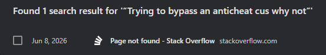

## Introduction

  
<i>Figure 1: A Portrait of Pierre-Marc-Gaston de Lévis. Source: [Académie Française (The French Academy)](https://www.academie-francaise.fr/les-immortels/pierre-marc-gaston-de-levis)</i>  

> <i>Il est encore plus facile de juger de l'esprit d'un homme par ses questions que par ses réponses.<i>  
> ("It is easier to judge the mind of a man by his questions rather than his answers.")  
> — Pierre Marc Gaston de Lévis  
> <i>Maximes et réflexions sur différents sujets de morale et de politique</i> (1808)[^1]  

Questions are the cornerstone of learning. After all, how can you learn something if you aren't asking questions? How do I add numbers together? How do I fix a flat tire? How do I cook a beef wellington? How do we prove that $P=NP$ is false? While no one can exactly answer that last question, I think you get the idea. We learn by asking questions, by inquiring into the things that intrigue us, that perplex us—things we don't understand or comprehend, but that we'd like to. But is there such a thing as a "bad question?" If you ask your teachers or professors, many of them will probably say no. After all, they want you to engage with the class and the material, to truly think about what it is you're learning, and asking questions is a great way to do that, regardless of what that question may be.  

However, if you're a man named Eric Raymond, then the answer is a solid "yes." In his eyes, if you want to learn something, you can't just ask a question—you need to ask a <b><i>smart</i></b> question.

## Everything You Need to Know About Smart Questions

If you're like me from 15 minutes ago and this is the first time you've ever heard the term "smart question," you're probably wondering what that is. Eric Raymond thoroughly describes them in his essay, ["How To Ask Questions The Smart Way,"](http://www.catb.org/esr/faqs/smart-questions.html#intro) but I won't make you read all that. To put it simply, smart questions are questions that respect the time, intelligence, and culture of the people you'd like to answer your question (presumably, experts in that field). Smart questions aren't focused on the complexity of a problem or inquiry so much as they are on the precision of, the effort put into, and the attitude within the question itself. With that in mind, let's take a quick look into how exactly one goes about writing a smart question.

### Precision

  
<i>Figure 2: A Red Target. Source: [The Target Corporation](https://corporate.target.com/media/collection/b-roll-and-press-materials/target-logos)</i>  

Smart questions need to be precise. You want to provide enough information for potential helpers to understand the problem and the circumstances surrounding it, but you don't want to overwhelm them with irrelevant information that will only serve as extra work for them to do. The goal is to allow experts to diagnose your problem quickly so that they can also provide an answer quickly, and that starts with being specific and objective. Describe the raw symptoms of your issue instead of any personal theories you might have. After all, if your theories were any good, you wouldn't be asking for help. Begin by using an "object-deviation" description in your subject header[^2]. Describe what is being affected and what it's doing differently. This helps people understand both what you're having a problem with and what the problem is at a glance. From there, prioritize relevance over volume in the body of your question. Instead of dumping pages of code or logs, just include the bare minimum for a reproducible test case to isolate your issue. To wrap things up, provide your context chronologically. If your problem involves a sequence of events, describe the steps that led up to the error in chronological order to help the experts trace your steps.  

If you still don't understand why precision is important, think of it this way: if you're feeling sick and you go to the doctor, you're not going to tell them every little thing you've done all week. You'll describe your symptoms and the things you've done that may have caused them, because you know that'll actually help the doctor solve the issue.

### Effort

  
<i>Figure 3: A Man Pushing a Boulder up a Slope. Source: [Lingoland](https://lingolandedu.com/en/english-english-dictionary/effort)</i>  

If you have a problem, you should put a decent amount of effort into trying to solve that problem on your own before you go asking strangers on the internet for help, and your question should reflect that you've done so. Do your homework: search the web, read the relevant manuals, check FAQs, and search through existing project archives. If you're having an issue with a widely known system, project, or device, chances are that someone else also had the same issue. If, after doing all, that you still haven't found a solution, make sure you list what you've done in your question. What did you search? What manuals or FAQs did you read? What forums did you comb through, and what fixes did you try to make that didn't work? Finally, if someone does answer your question and solves your problem, send a follow-up to the forum or mailing list letting everyone know your issue was resolved and thanking them for their help. By putting in the effort and showing it, you demonstrate to everyone that you aren't just some lazy bum looking to get other people to do your work for you. Instead, you're showing that you actually care about this issue and that you want to learn and improve.  

As the saying goes: <i>"You get out of it what you put into it"</i>, and if you don't put any effort into your question, people won't put any effort into their answers.

### Attitude

  
<i>Figure 4: A Man Sitting in Front of His Laptop, Thinking. Source: [Adobe Stock](https://stock.adobe.com/search?k=person+thinking+in+front+of+computer&asset_id=321418053)</i>  

In the wonderful world of online forums, your attitude will often determine whether you're treated as a serious participant or—in Eric's words—a "loser," to be ignored and metaphorically spit on. So how do you avoid being labeled as a "loser"? Well, for starters, avoid entitlement and urgency in your questions. If your problem needs to be solved quickly, that's a "you" problem, not the experts'. Don't act like you're entitled to a free solution, because you're not. Contrary to what you might think, adding urgency will only make people less likely to answer your question. At the same time, don't overcorrect into groveling, constant apologizing, or self-deprecation. No one wants to attend your pity party, and it only distracts from the actual technical issue. Make sure to avoid using slang or instant-messaging shortcuts as well. Typing "u" instead of "you" doesn't make you seem cool; it just shows that you're too lazy to type two extra letters. If the feedback you get is a blunt "RTFM" (Read the Fucking Manual) or "STFW" (Search the Fucking Web), handle it with maturity instead of trying to be defensive. If that's their reply, chances are you failed to do your homework before asking your question, and the answer to your problem is probably much simpler than you might expect—simple enough that an expert thinks you could solve it by just reading the manual on your own. Ultimately, just remember that the people answering your questions are volunteers, not your personal customer service desk. Try to keep your questions easy to engage with and interesting to solve. Give them a puzzle, not a homework assignment.  

If you're a waiter, chances are that you'll help the customer who politely asked for another fork over the one who barks, "Go get us another one!" The internet works the exact same way. If you bring the right attitude to online forums, then people will actually want to help you.

### But Wait—There's More?

Hopefully, you get the basic gist of how to ask a smart question. Of course, I'm not trying to recap Eric's entire essay; there are plenty of things I haven't mentioned, including what you should do before and after you ask your question. This includes doing the proper research into where you should ask your question, how you should respond to replies—whether they're snarky, rude, or actually useful—and how to ask follow-up questions. All of that is beyond the scope of this paper. Instead, I'd like to show you the difference between a smart question and a dumb question so that you might better understand what exactly a smart question looks like. To do this, we'll be making a quick trip to Stack Overflow.

## A Smart Guy Asked a Smart Question

  
<i>Figure 5: A Green Check Mark. Source: [Gregory Maxwell](https://commons.wikimedia.org/wiki/File:Green_check.svg)</i>  

To see what a smart question actually looks like in the wild, let's look at a good example: ["How do I programmatically enable a stylesheet?"](https://stackoverflow.com/questions/79952781/how-do-i-programmatically-enable-a-stylesheet), asked by a user named [Finley Baker](https://stackoverflow.com/users/19216516/finley-baker). 

### What was the Question?

Finley was trying to build a client-side theme-switching feature. Using Javascript and the CSS Object Model (CSSOM), they wanted to dynamically enable or disable specific stylesheets depending on the theme the user picked. They started with a straightforward approach, looping through the stylesheets as shown in the example code they provided:
```javascript
for (const styleSheet of document.styleSheets) {
  styleSheet.disabled = styleSheet.title !== currentThemeName;
}
```
While turning the stylesheets off worked perfectly, turning them back on caused some weird, inconsistent rendering issues in Chromium browsers (even though it worked fine in Firefox). They decided to look through the official MDN and W3C doccumentation, but found that the web standards were pretty vague. MDN themselves state that "`disabled === false` does not guarantee the style sheet is applied (it could be removed from the document, for instance),"[^3] while W3C almost parrots them, stating that even when the `disabled` flag is unset, "it does not necessarily mean that the CSS style sheet is actually used for rendering."[^4]. So, Finley took a different approach and tried to target the HTML `<link>` and `<style>` elements directly through the DOM (Document Object Model). You can find their code below:
```javascript
const styleElems = [...document.querySelectorAll('style[title]'), ...document.querySelectorAll('link[rel="stylesheet"][title]');

for (const styleElem of styleElems) {
  styleElem.disabled = styleElem.title !== currentThemeName;
}
```
Unfortunately, they ran into the exact same bug. This made perfect sense, because further reading revealed that `HTMLStyleElement` is just a shortcut for `StyleSheet.disabled`. Realizing that the standard `disabled` property wasn't reliable across different browsers, Finley wrapped up their findings and nicely asked the community if anyone knew of a better, more dependable alternative for dynamic theme-switching.

### Why was it Smart?

So, now that we know what the question was, let's look into why it was smart. Let's start with precision. Finley clearly defined what they were trying to do and what problems they were facing: they wanted to add client-side theme switching to their website, but enabling the feature didn't work on the Chromium browser specifically. They described exactly what they did, providing the minimal amount of code needed for readers to understand their process. They remained objective and left out any personal theories they had about why their code wasn't working. To top it off, they detailed the actions they took in sequential order to help the readers get a clear picture of the entire process.  

Then there's effort. Finley clearly demonstrated the effort they put into trying to solve their issue before posting on Stack Overflow. Not only did they read the official documentation—which they quote in their post—they pointed out why the documentation wasn't able to help them solve their issue. In addition to that, they still tried their best to implement an alternative solution. Even if that second solution didn't work, the fact that they designed one after reading the documentation displays the exact effort people look for in questions on Stack Overflow.  

Finally, there's the attitude. They didn't include any sense of urgency in their post, nor did they use any slang or instant-messaging shortcuts. They remained completely professional as they described the technical issue they were facing. Now, was their question perfect? No. Their subject header was a vague question that required anyone interested to open their post just to figure out the problem. Additionally, after receiving a reply with a solution, they didn't edit their post with the results, nor did they offer their thanks to the user who helped them. But for the most part, this serves as an excellent example of a smart question.

### Smart Questions get Smart Answers

Remember how I mentioned that Finley got a working solution? Let's see what kind of answers a smart question will get you.  

A user named Kaiido pointed out that the bug was caused by an obscure, legacy browser feature called "Alternative Style Sheets." They elaborated further by explaining that when a developer adds a native title attribute to `<link>` or `<style>` elements, the browser takes internal ownership of them so users can theoretically switch themes directly from the browser's UI (e.g., Firefox's <i>View</i> -> <i>Page Style</i> menu). Because the browser's native engine handles the rendering logic for these titled stylesheets, it immediately overrides and re-disables them behind the scenes, causing the inconsistent rendering bugs Finley experienced in Chromium. To fix this, Kaiido suggested that Finley replace their standard `title` attribute with a different, custom attribute like `data-title` instead. Since the browser doesn't recognize `data-` attributes as theme triggers, it stops interfering with the JavaScript. Along with this suggestion, Kaiido provided the code snippets below to show how one might implement this solution:
```javascript
const select = document.querySelector("select");
select.onchange = e => {
  const currentThemeName = select.value;
  for (const styleElem of document.querySelectorAll(":is(link,style)[data-title]")) {
    styleElem.disabled = styleElem.dataset.title !== currentThemeName;
  }
}
select.onchange();
```
```html
<link data-title="red" rel=stylesheet href="data:text/css,body{color:red}">
<link data-title="green" rel=stylesheet href="data:text/css,body{color:green}">
<style data-title="red">p { border: 1px solid blue }</style>
<style data-title="green">p { border: 1px solid pink }</style>

<select>
  <option>red</option>
  <option>green</option>
</select>
<p>I should change color and border.</p>
```
So, in response to Finley's smart question, Kaiido provided a detailed and helpful smart answer. It's important to note that Kaiido themselves stated that they weren't even aware of the "Alternative Style Sheets" feature until they saw Finley's post and decided to look into the problem. Like I said in the "Attitude" subsection, give the readers a puzzle, not a homework assignment. Even if they aren't familiar with the specific issue you're facing, experts are passionate about software engineering. They'll take your problem as both a challenge and a way to expand their own knowledge of the subject. It just goes to show that smart questions do, in fact, get you smart answers.

## A Dumb Guy Asked a Dumb Question

  
<i>Figure 6: A Red X. Source: [Wikimedia Commons](https://commons.wikimedia.org/wiki/File:Red_X.svg)</i>  

Now that we know what a smart question looks like in the wild, let's look at a bad example: "Trying to bypass an anticheat cus why not", asked by a user named xvi.  
<i>The Link to xvi's post has removed. Please see the disclaimer at the bottom of the essay.</i>

### What was the Question?

I would summarize xvi's post, but it's so short at just four sentences long that summarizing it would just be rewriting it. Instead, I'll just put their entire post below:  

> I’m really new to this but here I found this in a remote spy

```lua
local Event = game:GetService("ReplicatedStorage")["yr4253\010"]
Event:InvokeServer(
    "\x19|\x13Sa\x01~BrqJ~A@j \bj8!th\x01va_f\x04\n,\x05}:~]YoW~\x01;Rvo\x01}\x12\\g\x1A\b]\x01tT\x05\\DlO\b\x01:T\x06\x1D\x18\a\x17)ar",
    "\x1Auc.\x1Cq\x0F^i\x06Ix]Yl[\x7FqT\"\x02o\x15h\x13(c\x0Fz^uvK\x7F^DuQ{\x06A\"pk\x19hf,c\a\x11[vt:\x11U0j'`uN sji\x00aYc\x00\x05",
    "\x18s\x15Z\x16u\x05+itH\v]YlZ|sT!p\x1D\x1Ah\x13,\x17\x00x*\x00\x01@\f)7u$uvKTughh\x10+\x12\x0F\x11[|\x05<\x11.Dl `\x01KZ\an\x1Ftg^\x11\x05~",
    "e4f34921-54f4-472d-a6b7-0ad55c6a2b6a"
)
```

> And anytime I replay the function I get banned immediately, how do I silently trigger or call into whatever’s getting fired so I can hide my code and not get banned? If needed my discord is @surhgeons

### Why was it Dumb?

Once again, we'll start with precision. In stark contrast to Finley—who provided a clear objective and a minimal, reproducible example—xvi's post completely lacks precision, starting right at the top with their header. Instead of using the "Object-Deviation" format to describe their issue, they use a vague, casual title that tells the reader nothing about their technical environment. While Finley more than made up for their improper header with the body of their post, xvi does not. They never mention what game or platform they're working on, and instead of isolating the problem, they dump a large block of unreadable, obfuscated strings captured from a "remote spy." This is the exact opposite of a clean code snippet; it forces the reader to do the heavy lifting of decoding the payload just to understand what's being sent. Furthermore, they provide no chronological context or sequence of events leading up to the ban, leaving readers completely in the dark.  

Then there's effort. While Finley clearly demonstrated that they did their homework by quoting the official documentation and explaining why their secondary solution failed, xvi shows absolutely zero effort. Hiding behind their declaration that they're "new," they don't list a single troubleshooting step they took to investigate the ban. They haven't even tried to modify the code, analyze how it works, or look into how the specific anticheat system they're dealing with—which they fail to specify—even works. Instead, they act as—once again, in Eric's words—a "lazy sponge," who dumps their raw data into the forum and expects the community to hand them a fully functional bypass on a silver platter.  

Finally, there's the attitude. Finley maintained a professional, objective attitude while explaining their issue. xvi did not. They used the shortcut term "cus" in their title, signaling to readers that they were lazy and didn't intend to treat the community seriously. Beyond that, they led with self-deprecating groveling ("I'm really new to this..."), which does nothing but serve as a distraction from the technical issue at hand and an attempt to garner sympathy from the community. Worst of all, while Finley's biggest mistake was failing to follow up publicly, xvi tried to completely undermine the community aspect of Stack Overflow by moving the conversation to Discord. By trying to move the conversation into a private, one-on-one chat, they ensure that any potential solution will be hidden from the public, rendering their thread useless for future users searching through Stack Overflow.  

Putting aside the fact that xvi is trying to bypass a game's anticheat—which is against the terms of service of essentially every game that uses one and goes against Stack Overflow's own code of conduct—their post is the textbook definition of a dumb question. From a careless and uninformative header to an absolute lack of research, a request for an exploit handout, and an attempt to take the communication offline, it violates almost every rule in the book for smart questions.

### Dumb Questions get Dumb Answers—or None At All

So, what kind of answer did xvi get? None. His question was dumb—it showed a lack of effort, a lack of a desire to learn, and it oozes of laziness and arrogance. So, nobody bothered answering them, and nobody ever will. Not just because they asked a dumb question, but because their post was closed by Stack Overflow mods only 20 minutes after it was posted.

## Am I a Comp Sci Major or an English One?

  
<i>Figure 7: A Man Thinking. Source: [iStock by Getty Images](https://www.istockphoto.com/photo/pensive-thoughtful-contemplating-caucasian-young-man-thinking-about-future-planning-gm1388645967-446222427)</i> 

"Tayten, I thought you said you were a computer science major. Why are you providing such an in-depth analysis into how to properly ask questions? Isn't it an English major's job to analyze sentence structure and wording?" Well, if you've read this much and it still hasn't clicked why asking smart questions is important, let me spell it out for you. I mentioned earlier that the people who comb through online forums are volunteers. These volunteer experts are passionate about what they do, and they're more than happy to share their knowledge with the next generation of experts whom they may call colleagues one day. But time is a valuable resource—one that we can never get more of. There are so many people who need help, so many questions that need answers, yet only so many experts to answer them. As a result, they pick and choose. They'll choose the questions they think are worth answering and ignore the ones they believe to be unproductive and a waste of time. Asking smart questions is how you distinguish yourself. It makes it more likely that you'll get a response, because you've shown that you're someone worth helping. You put the effort into trying to solve your problem beforehand, you made your question precise by providing exactly what an expert needs to know, and you behaved yourself while demonstrating a willingness to learn. THAT'S someone worth responding to. Not someone just trying to push the burdens of their problems onto someone else.

## Conclusion

Questions are the cornerstone of learning. Keyword being <b>learning</b>. You should ask questions to grow, not because you want someone else to do the work for you. When you show a genuine desire to engage with a problem, online communities will gladly match your energy and share their knowledge. After all, the best tech forums aren't just troubleshooting queues—they're places where passion is shared and passed down to the next generation. If you use them just to find an easy way out, you miss the point entirely. So, if you want to get smart, be smart. Ask smart questions, and smart answers will follow.

<hr>

While writing this essay, xvi's original post was removed by Stack Overflow moderators for violating their Code of Conduct. As such, the link to the post no longer works. Below is what appears in my browser history when I search for the title of xvi's post:  

  
<i>Figure 8: A Screenshot of a the Results from Searching xvi's Post Title in my Search History.</i>  

As you can see, the Stack Overflow URL that once redirected to their page now displays a "Page not found" error. For record-keeping purposes, here is the [link to the taken down post](https://stackoverflow.com/questions/79954245/trying-to-bypass-an-anticheat-cus-why-not) (the link is dead). In case their account is also removed or deleted, I have attached a screenshot of their profile below:  

  
<i>Figure 9: A Screenshot of a xvi's Stack Overflow Profile.</i> 

<hr>

<i>This essay was grammar checked using Google Gemini.</i>  
<i>All images belong to their respective copyright holders.</i>

<hr>

[^1]: [Wikipedia, "Pierre Marc Gaston de Lévis, Duke of Lévis"](https://en.wikipedia.org/wiki/Pierre_Marc_Gaston_de_L%C3%A9vis,_Duke_of_L%C3%A9vis#:~:text=The%20quotation%20often,%5B1%5D)
[^2]: [Eric Raymond, "How To Ask Questions The Smart Way", 21 May 2014](http://www.catb.org/esr/faqs/smart-questions.html#intro)
[^3]: [MDN Web Docs, "StyleSheet: disabled property"](https://developer.mozilla.org/en-US/docs/Web/API/StyleSheet/disabled)
[^4]: [W3C, "CSS Object Model (CSSOM) Module Level 1", 1 May 2026](https://drafts.csswg.org/cssom/#concept-css-style-sheet-disabled-flag)