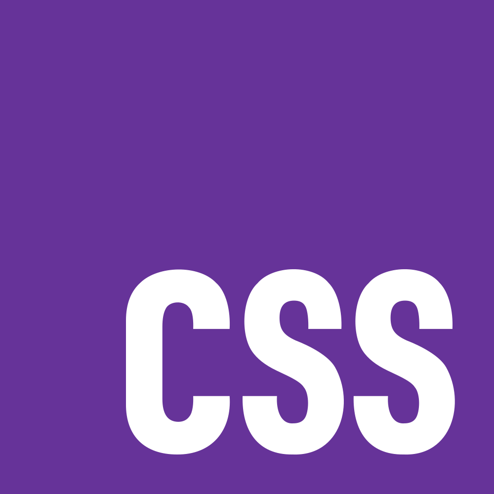
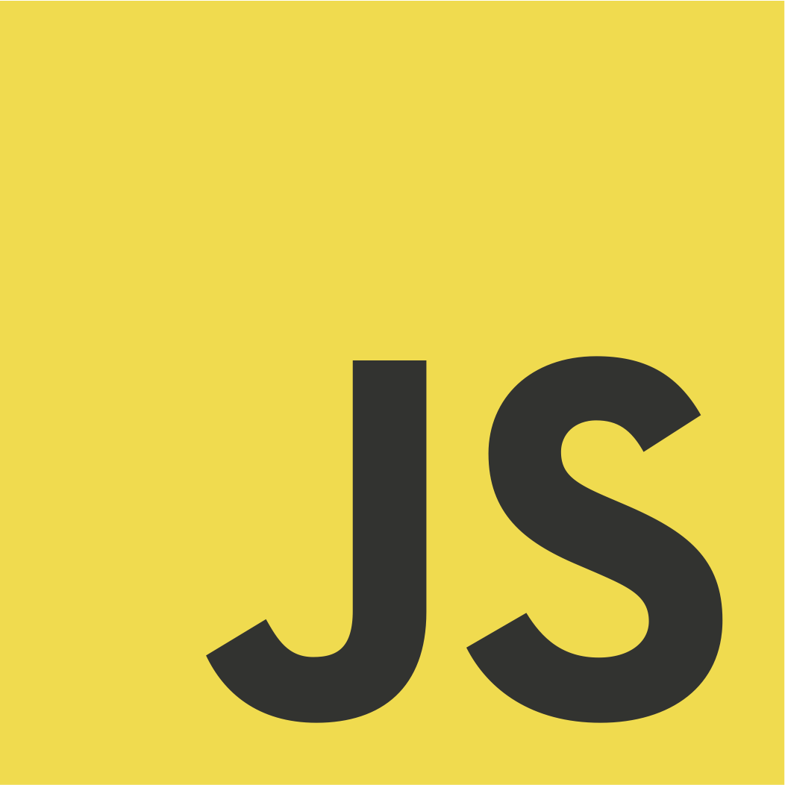

## Introduction

Have you ever used the internet? You probably have. After all, you're reading this essay on a website that you accessed using the internet. But have you ever stopped to wonder why this website works? Or, for that matter, why any website works? Why is it that clicking a button sends you to another page? How does the website know which page to send you to? Consider a login screen: how come the website knows to submit whatever you typed after clicking a button or pressing the "enter" key? This is the functionality and interactivity of a website, and it's possible thanks to frontend languages like JavaScript and TypeScript. As the subjects of my class content this past week, I wanted to take the time to take a deeper look at what these languages are and what they do.  

## A Little Bit About JavaScript

Before we can talk about TypeScript, we have to talk about JavaScript. So, what is JavaScript? Well, as I said earlier, JavaScript is a frontend programming language made to add functionality and interactivity to websites. Every website you've ever visited has used JavaScript or some offshoot of it. Without it, you'd have to manually type in new URLs just to go to a different page on the same website, among many other, much more tedious things.  But what makes JavaScript so special amongst the other languages used to put together a website? When it comes to building websites, there's a well-known trio of languages that often comes to mind: HTML, CSS, and JavaScript.  

### Structuring with HTML

  
<i>Figure 1: The Official HTML Logo. Source: [W3C](https://www.w3.org/html/logo/index.html)</i>  

HTML is a language used to create the elements you see on a website, from the text to the hidden boxes that hold that text, to the images and buttons on a screen. Everything you see on a screen is created using HTML. For example, the code below would create a webpage that displays nothing but a single line of text:  
```html
<body> <!-- This is the HTML -->
  <p>This is some text.</p>
</body>
```

### Styling with CSS

  
<i>Figure 2: The Official CSS Logo. Source: [CSS-Next/logo.css](https://github.com/CSS-Next/logo.css/blob/main/css.square.svg)</i>  

CSS is the language used to style your website. No one wants to see a bland website made up of just generic text and basic geometric shapes. CSS helps web developers add a little spice and flavor to their sites. From the weights and fonts of text to the shapes and sizes of images and buttons, CSS is what makes a website go from an eye-sore to an eye-pleaser. For example, the code below would modify our HTML and make the text red and bolded:
```html
<head>
  <style> /*This is the CSS */
    .p {
      color: red;
      font-weight: bold;
    };
  </style>
</head>
<body> <!-- This is the HTML -->
  <p>This is some text.</p>
</body>
```

### Adding Logic with JavaScript

  
<i>Figure 3: The Unofficial JavaScript Logo. Source: [voodootikigod/logo.js](https://github.com/voodootikigod/logo.js)</i>  

Finally, there's JavaScript. Unlike HTML and CSS, JavaScript isn't used to create or modify the structure of elements on a webpage. Instead, it uses the elements created by HTML to collect, store, and modify data. That is what makes it the most important language in web development.
```html
<head>
  <style> /*This is the CSS */
    .button {
      height: 250px; /* Make the button 250 pixels tall */
      width: 150px;  /* Make the button 150 pixels wide */
    }
  </style>
  <script> /* This is the JavaScript */
    let allComments = [];
    
    function addComment() {
      let userInput = document.getElementById("box");
      allComments.push(userInput.value);
      userInput.value = ""; 
    }
  </script>
</head>
<body> <!-- This is the HTML -->
  <input type="text" id="box" placeholder="Enter comments here">
  <button type="button" class="button" onclick="addComment()">Submit</button>
</body>
```
There's a lot to unpack here, so let's break it down. First, we create an input box and a button using HTML. We give the input box its own ID (like a nametag) so that the JavaScript code knows what to look for (we'll come back to this). Then, we use CSS to specify the size of the button. Now it's exactly 250 pixels tall and 150 pixels wide, and it'll remain that size no matter how big your monitor is. Finally, there's the JavaScript. Looking at the code for our button, we can see that when it's clicked, it'll run a function (a set of predetermined instructions) called "addComment". Looking at our JavaScript code, we can see that the "addComment" function locates our input box using its ID, then takes whatever is in that box and stores it in an array. Basically, it takes whatever the user entered and stores it in a box with all of the other things users have entered, then it empties the text box.

In a nutshell, you can think of HTML, CSS, and JavaScript like the parts of a car. HTML is the body of the car: the wheels, the seats, and the pedals. CSS is the coat of paint, the shape of the body, and the kind of wheels it has. JavaScript is what's under the hood: the engine that runs your car and the electronics that actually respond every time you push a button to open the window or turn on the lights.

## TypeScript: JavaScript, but Better

  
<i>Figure 4: The Official TypeScript Logo. Source: [microsoft/TypeScript-Website](https://github.com/microsoft/TypeScript-Website/blob/f407e1ae19e5e990d9901ac8064a32a8cc60edf0/packages/TypeScriptlang-org/static/branding/ts-logo-512.svg)</i> 

So, JavaScript seems pretty cool. But if it's thanks to JavaScript and its offshoots that websites even have functionality, how can anything be better than it? Well, that's where TypeScript comes in. TypeScript is one of these offshoots of JavaScript. In more official terms, it's called a superset of JavaScript. This means that it simply builds off of and adds some extra features to the JavaScript language. "But you were just talking about how useful JavaScript was, why would you need to add anything?" Well, to answer that question, let's take a look at some more JavaScript. When you create variables in JavaScript, they can store one of three basic types of data: numbers, strings (characters, words, sentences), and booleans (true or false). When you code in JavaScript, the program simply guesses what type of data your variable is supposed to store.
```javascript
let variable = 0;
```
The program assumes that my variable is supposed to store numbers. But with JavaScript, you can simply change what type of data is stored in that variable later on.
```javascript
let variable = 0;
variable = "Hello World!";
console.log(variable);
```
In my command console, I'll see the text "Hello World!" on display. While this could technically provide a great deal of flexibility, it also creates a lot of opportunities for your code to break or behave unpredictably. See below:
```javascript
let variable = 0;
variable = true;

function myFunction(something) {
  return something + 1;
}
```
My function should increment whatever number is passed through it, but JavaScript doesn't check what's being passed into the function. So if I pass "variable" into myFunction, how does the program add 1 to "true"? It guesses and outputs an unexpected result (in this case, 2), which can cause massive bugs down the line. Another issue with these implicit types is readability:
```javascript
function myFunction(variable1, variable2) {
  return variable1 + variable2;
}
```
What is this function supposed to do? What is it accepting as its parameters (inputs), and what is it supposed to return (output)? I have no idea. At first glance, you might say that it's supposed to add together two numbers. But this syntax could also be used to combine two strings. I don't know which of these purposes this function is supposed to be used for, and I won't ever know unless the person who created this function tells me. So, how does TypeScript solve this issue? By adding static types to JavaScript. Unlike JavaScript, which relies on implicit types for variables, TypeScript requires you to explicitly declare the type of every variable you create, what type of data a function will accept as inputs, and what type of data it will return. See below:
```typescript
let variable: number = 0;

function myFunction(variable1: number, variable2: number): number {
  return variable1 + variable2;
}
```
Now we know that my variable is supposed to store a number, and now it can only store numbers. Additionally, we know that myFunction will only accept two numbers as its parameters and that it'll return a number when called. If I try to assign another data type to my variable like we did before:
```typescript
let variable: number = 0;
variable = "Hello World!";
```
The program will throw an error before the code even runs. This one modification to JavaScript helps to not only reduce the chances for errors, but makes code much easier to read for everyone. And code readability is essential when you're working on a project as a team.

## Thoughts on TypeScript

  
<i>Figure 5: A Man Thinking. Source: [iStock by Getty Images](https://www.istockphoto.com/photo/pensive-thoughtful-contemplating-caucasian-young-man-thinking-about-future-planning-gm1388645967-446222427)</i> 

At first glance, the syntax for TypeScript seems quite intuitive and easy to understand. However, I'm not a big fan of some of the styling practices used in the language. An example of this involves function declarations. It's often considered better practice to use named function expressions instead of function declarations, as seen below:
```typescript
/* BAD: Function Declaration */
function myFunction() {}

/* GOOD: Named Function Expression */
const myFunction = function myFunction() {};
```
In my opinion, that just seems like unnecessary, extra work, but that's just a minor gripe I have. A more pressing concern I have is with arrow functions:
```typescript
/* Traditional Function Expression */
const getSizeDescription = function(size: number): string {
  return size > 10 ? "Large Size" : "Small Size";
};

/* Arrow Function */
const getSizeDescriptionArrow = (size: number): string => (size > 10 ? "Large Size" : "Small Size");
```
Both of these functions perform the same task: they take a numerical input, size, and return a string based on whether that input is larger than 10. Personally, I don't understand why someone would prefer the latter syntax. If I'm trying to read someone else's code, navigating through arrow function notation feels like a nightmare. But, maybe that's just my naive perspective as a new learner of TypeScript. I guess we'll see if my views change over time.

Comparing TypeScript to other languages I have worked with, it is quite intuitive to read on the surface (when you are not using shorthand syntax like arrow functions). See the comparison below:
```typescript
/* TypeScript */
const hello: string = "Hello";
const world: string = "World!";
console.log(`${hello} ${world}`);
```
```java
/* Java */
String hello = "Hello";
String world = "World!";
System.out.println(hello + " " + world);
```
```c
/* C */
char hello[] = "Hello";
char world[] = "World!";
printf("%s %s", hello, world);
```
All three of these code blocks will print "Hello World!" to the command terminal. You can tell it's a much more modern language compared to C, given that TypeScript has a native string type, whereas C requires character arrays to store strings. Similar to Java, the syntax is straightforward, and you don't need to implement complex workarounds to perform basic tasks.

## Workouts of the Day?

  
<i>Figure 6: A Brain Working Out. Source: [Vitalii Petrenko/Shutterstock.com](https://www.shutterstock.com/image-vector/brain-training-rock-muscles-barbell-modern-757605628)</i> 

With the start of our exploration into TypeScript came the introduction of "Workouts of the Day" (WODs). These were a part of a larger concept my professor called "Athletic Software Engineering." In simple terms, it's the idea that software engineering education should focus on improving a student’s competency in the development environment first, before moving on to higher-level software design and project management. You need to make sure students have the tools they need to solve a problem before asking them to solve it. If you give a student a toolbox, teach them how to use those tools, and then ask them to fix a broken door, they’ll think creatively about how they can use the tools at their disposal to fix it. If you instead just tell the student to fix the door without any foundational knowledge, they’ll just go to a store and try to find the specific tool they need for that one job. They don’t implement creativity in developing the solution. Instead, they just look for the most basic, straightforward one, which isn't always the most efficient and can be detrimental to larger projects. The Workouts of the Day aim to put the "athletic" in his "Athletic Software Engineering" philosophy. They’re time-limited programming challenges meant to test a student’s skills and efficiency. As a first impression, I think having some sort of mini code practice outside of larger homework assignments or projects could be helpful. It’d serve as good practice and a way to help make sure that the concepts and code we learn actually stick in our heads. However, we’ve only had two WODs so far as of the time of writing this, and both were quite simple, so I can’t say whether or not they’ve actually been helpful. Only time will tell, and I’ll wait to complete several more WODs before I make any sort of judgment on them.

## Conclusion

We’re off to a flying start with this course, jumping straight into JavaScript and TypeScript. I’m quite excited to dive deeper into TypeScript, especially since I had a brief introduction to JavaScript back in high school and am curious to see what else I can do with it. The WODs also seem like a great way to hone my skills and keep me sharp, but I’ll have to wait and see how they evolve as they get more complex. Overall, I’m looking forward to seeing how these foundational practices and new language features will help me grow as a developer throughout the rest of the semester.

<hr>

<i>This essay was grammar checked using Google Gemini.</i>  
<i>All images belong to their respective copyright holders.</i>