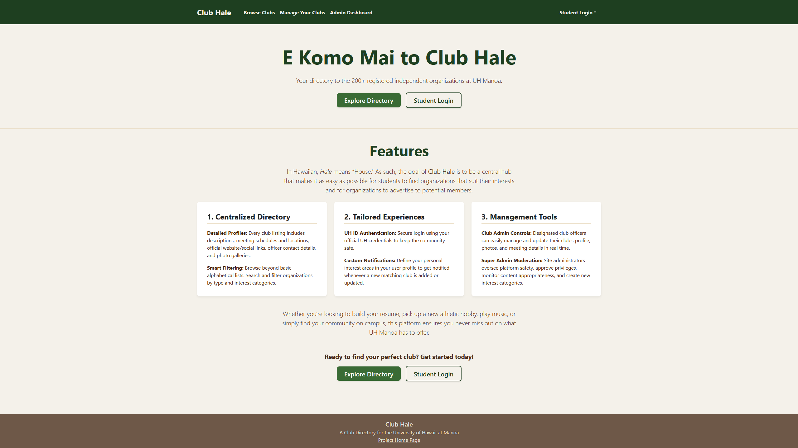
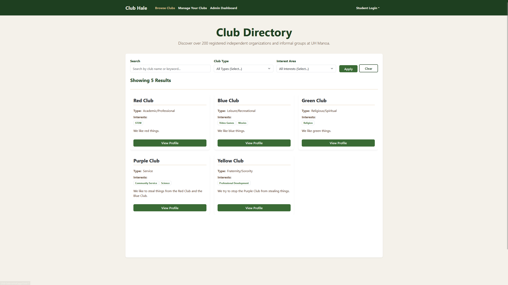
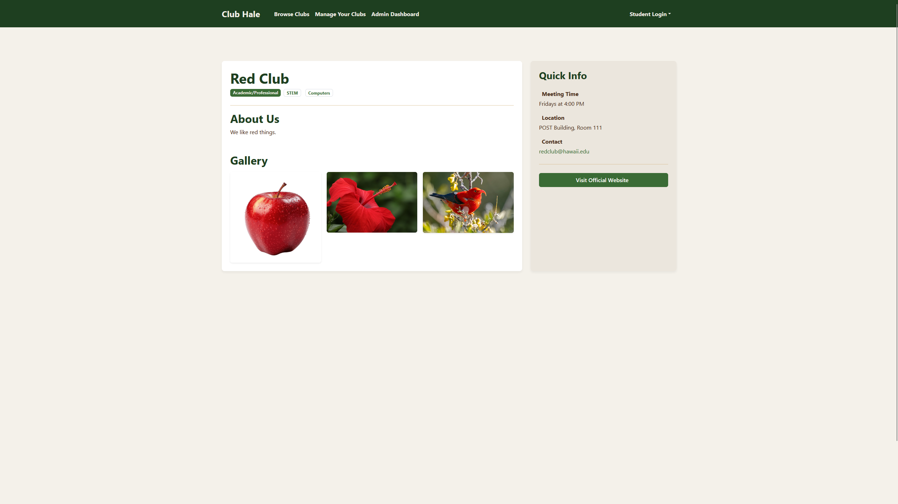
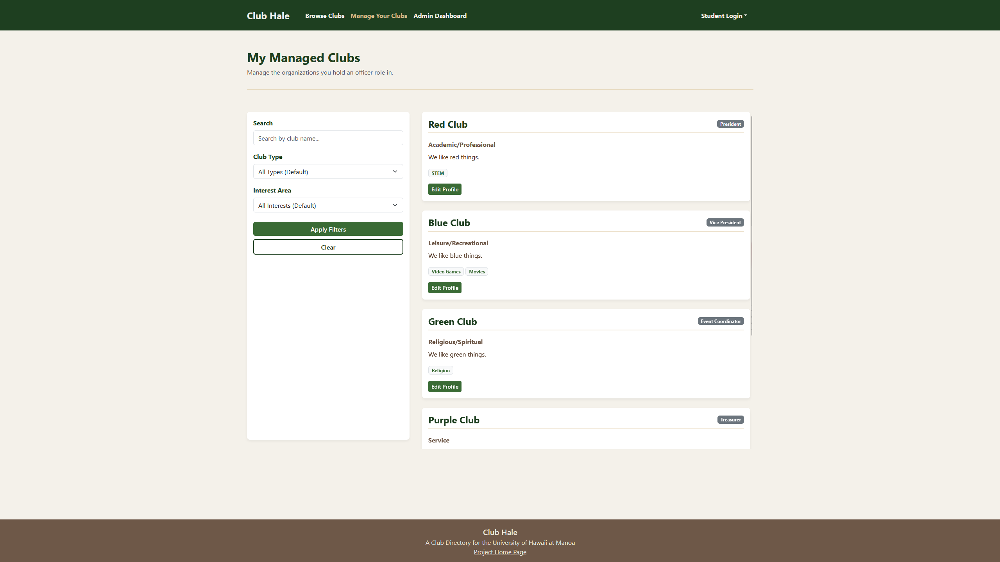
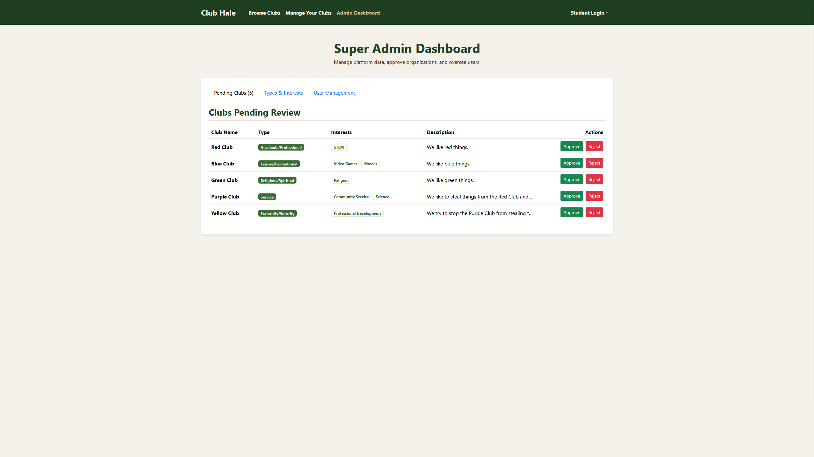
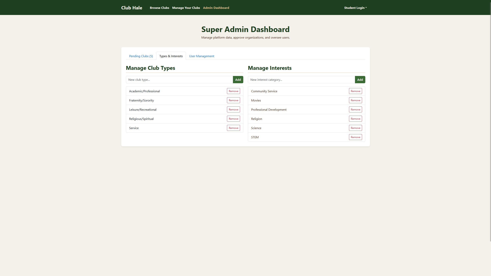
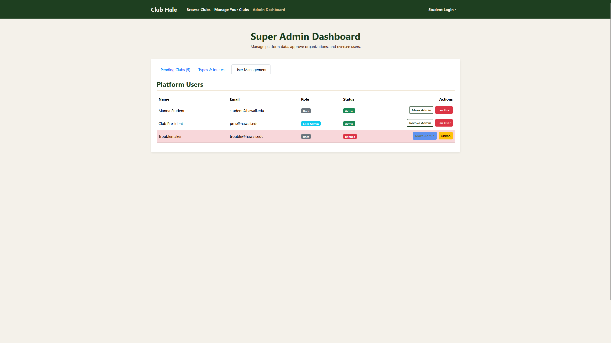

  
<small>The mock-up landing page for the Club Hale website.</small>

## Project Overview

Club Hale was a website meant to serve as a directory of all the clubs and student organizations at UH Manoa. The goal was to create a convenient, easy-to-use, and visually appealing web application that would have covered the needs of both students looking to join clubs and organizations seeking new members. Students would have been able to browse through the directory, filtering results by club type, interest categories, or keywords. Club profiles would have displayed a club's name, type, interest categories, description, meeting times and locations, contact info, photo gallery, and a link to its website. Club officers would have been able to manage their profiles, while the site's super admins would have been able to manage new club submissions, categories, user permissions, and ban statuses.

That being said, this project was never completed. I spent the Milestone 1 phase of the final project (the Mock-Up Phase) working on Club Hale, but I was unable to find other members to join the project. Ultimately, I was forced to end development on Club Hale, and I joined the <a href="https://tayten0.github.io/projects/rainbow-gyms.html" target="_blank">Rainbow Gyms</a> project for the Milestone 2 and 3 phases of the final project.

## My Contributions

Club Hale was a solo project, meaning all of the work was done entirely by me. This included selecting the initial concept from my professor's suggestion list, brainstorming desired features, designing page layouts, setting up the live deployment and database, and writing all of the code.

## What I Learned

As a solo project, I didn't learn much in terms of teamwork and collaboration, but I learned a lot on the practical side. For starters, I learned how to utilize GitHub organizations, projects, and issues to keep track of tasks effectively. Working entirely by myself also forced me to take ownership of the entire software development lifecycle—from conceptualization and UI design to setting up the live deployment and managing the database. Additionally, the project helped to reinforce and expand my knowledge of React and Bootstrap components, giving me greater confidence in building responsive layouts and handling complex user interfaces from scratch.

## Relevant Links

To learn more about the Club Hale project, feel free to visit the <a href="https://club-hale.github.io/" target="_blank">Club Hale Project Homepage</a>. Otherwise, you can find some other useful links below:  

<a href="https://club-hale.vercel.app/" target="_blank">The Club Hale Live Deployment</a>  
<a href="https://github.com/club-hale" target="_blank">The Club Hale GitHub Organization</a>  
<a href="https://github.com/club-hale/club-hale" target="_blank">The Club Hale Source Code</a>  

## Screenshots

All of the screenshots below were taken of the pages currently available on the website's live deployment.

### Directory Page

  

### Club Profiles

  

### Club Admin Dashboard

  

### Super Admin Dashboard

  
  
  
  
  

<i>The text on this project page was grammar checked using Google Gemini.</i> 