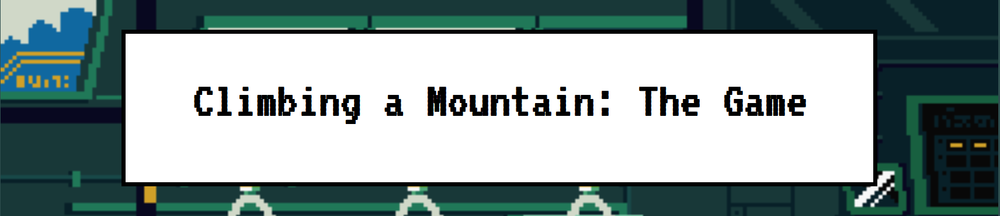
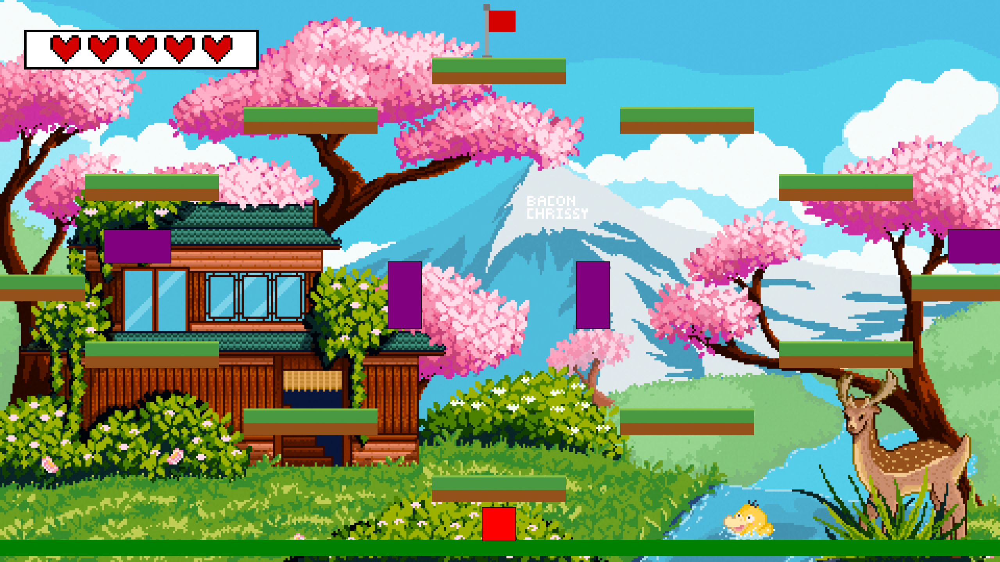

Climbing a Mountain: The Game was a simple 2D platformer I made during my sophomore year of high school. After spending most of our STEM Career and Technical Education (CTE) class learning the basics of HTML, CSS, and JavaScript, we spent our final few weeks diving into the P5.js library. This game was my final project for the class, where we were tasked with building our own web-based game from scratch.

Working on this solo was a huge learning experience. I had to handle everything myself, from brainstorming the initial concept and designing the levels to creating the assets, programming the logic, and testing for bugs. It really opened my eyes to how tough game development actually is. If a simple web game took this much work, I can only imagine how much effort goes into a proper commercial release.

The game is built using standard web languages with a heavy focus on P5.js. Coding the collision detection was definitely the hardest part, and it required a ton of different variables just to track the coordinates of every object. It’s definitely not perfect. For example, there's a known bug where holding down the jump button lets you phase right through platforms, which was an issue I couldn't quite solve back then.

My old school laptop died a while ago, so the only version I could recover was an older backup saved to my school cloud drive. Because of that, this version is missing a few final features and assets, and it still has some bugs. If you still want to check it out, the code is up on GitHub! Just keep in mind that since this was a high school project meant to be played locally, all the files are just sitting in one main folder.

<i>Note: I made most of the in-game assets myself, but the background art and music were not made by me. You can find the credits in the README.md file.</i>

Source: <a href="https://github.com/tayten0/mountain-game"><i class="large github icon "></i>tayten0/mountain-game</a>
