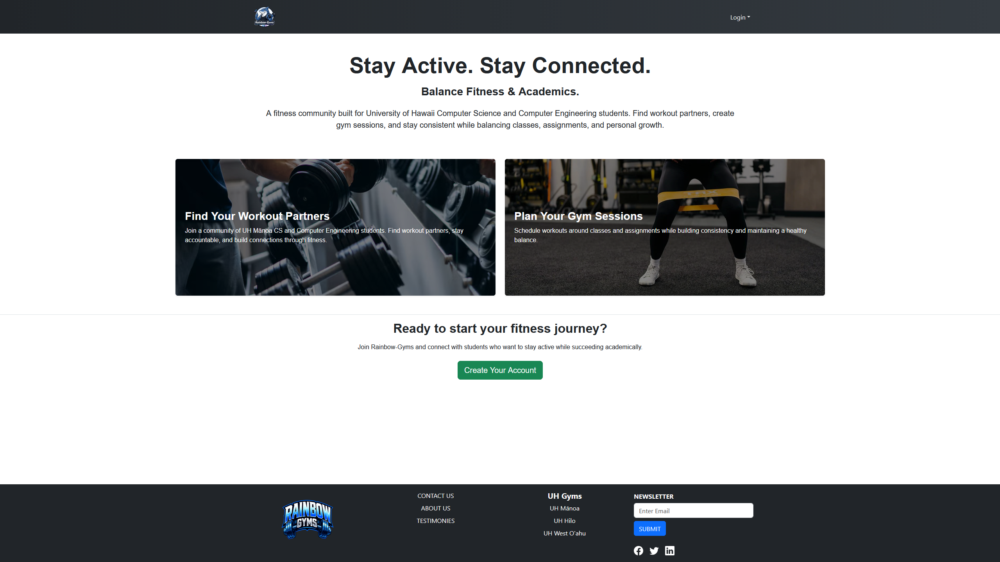
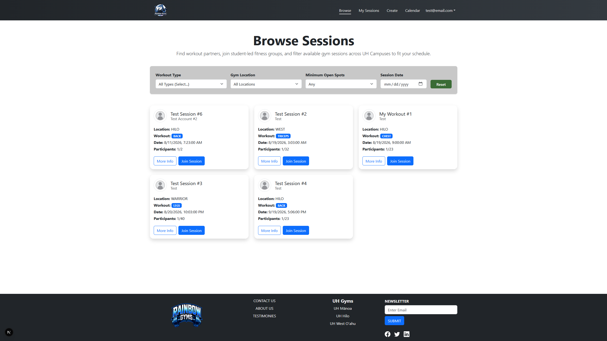
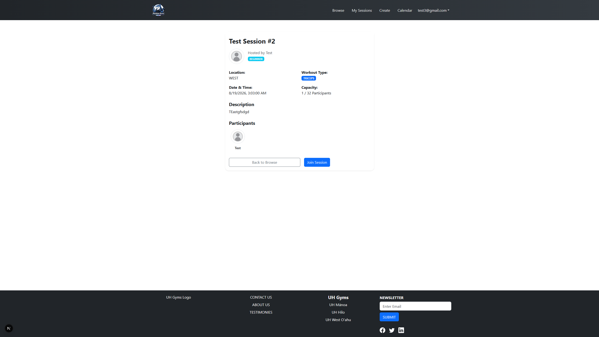
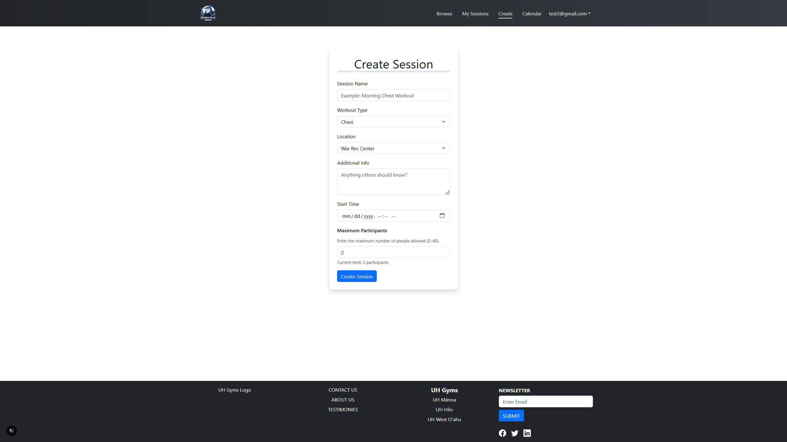
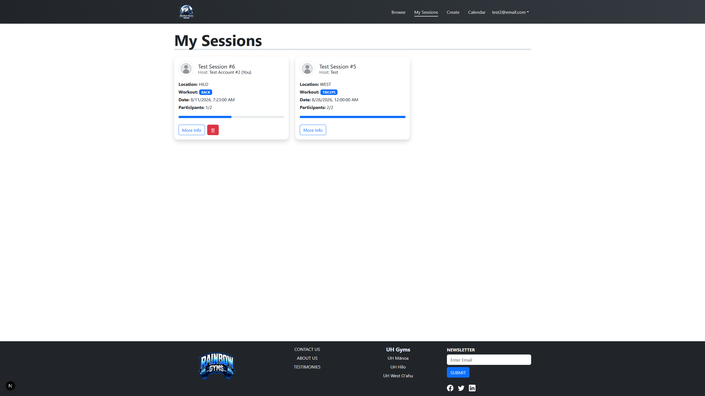
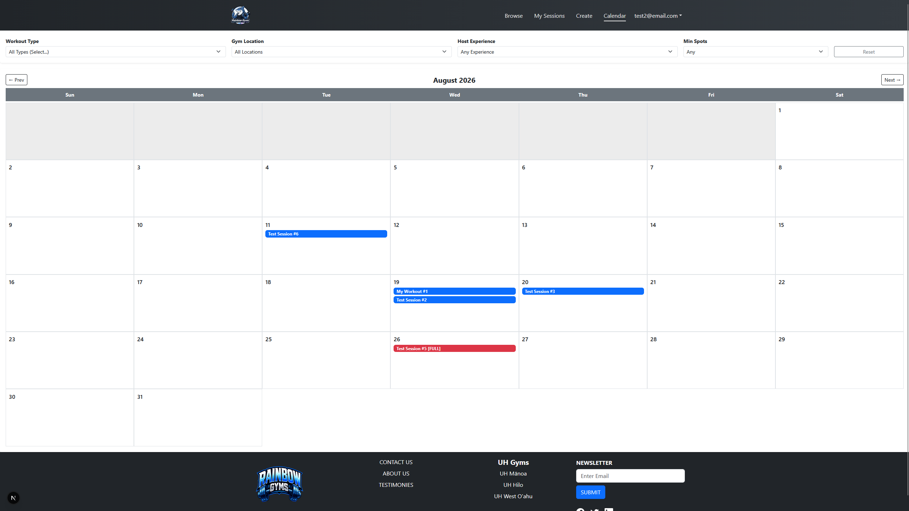
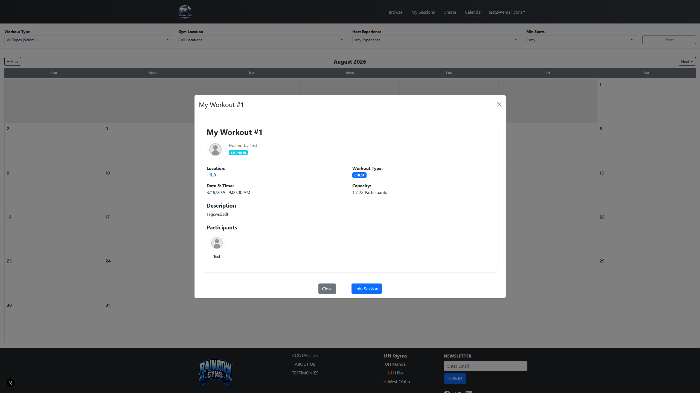

  
<small>The landing page for the Rainbow Gyms website.</small>

## Project Overview

Rainbow Gyms is a website designed to help University of Hawaii students get in better shape by allowing them to create or join workout sessions at gyms across University of Hawaii campuses. Users can search for sessions on the directory page or view them on the website's calendar page. Users can filter these results by workout type, gym location, and the number of available spots. On the directory page, users can also filter by date, whereas on the calendar page, this filter is replaced by one for the host user's experience level. Users can view a session's details, which include the session's name, description, host username and experience level, location, date and time, capacity, and a list of current participants. If there aren't any workout sessions that match what a user is looking for, they can create their own session, and a dedicated page is available for users to manage the sessions they have created or joined.

## My Contributions

My primary contributions to the project revolved around the directory components of the website, which allowed users to browse through the sessions stored in our database. This included both the directory page and the calendar page. I also helped create and implement the session details page and component, which displayed the session's details and host user information. Additionally, I was responsible for updating the project's homepage, creating the user and development guides, and uploading screenshots to showcase our progress during each phase of the project.

## What I Learned

Similarly to the <a href="https://tayten0.github.io/projects/club-hale.html" target="_blank">Club Hale</a> project, this project helped to reinforce and expand my knowledge of React and Bootstrap components. However, unlike my previous solo project, I was part of an actual team, which taught me a lot about collaborating on software development, communicating effectively, and coordinating tasks. I also learned better procedures for Git commits, including proper naming conventions and informative descriptions. Furthermore, because we were moving past the mock-up phase into fully realized development, I gained hands-on experience interacting with databases through Prisma schemas and code—covering everything from adding and pulling entries to querying and filtering data.

## Relevant Links

To learn more about the Rainbow Gyms project, feel free to visit the <a href="https://rainbow-gyms.github.io/" target="_blank">Rainbow Gyms Project Homepage</a>. Otherwise, you can find some other useful links below:  

<a href="https://rainbow-gyms-nextjs.vercel.app/" target="_blank">The Rainbow Gyms Live Deployment</a>  
<a href="https://github.com/rainbow-gyms" target="_blank">The Rainbow Gyms GitHub Organization</a>  
<a href="https://github.com/rainbow-gyms/rainbow-gyms-nextjs" target="_blank">The Rainbow Gyms Source Code</a>  

## Screenshots

Below are screenshots showcasing some of the main features of the current live deployment of Rainbow Gyms. For a more extensive user guide, please visit the <a href="https://rainbow-gyms.github.io/" target="_blank">Rainbow Gyms Project Homepage</a>.

### Directory Page

  

### Session Profiles

  

### Create a Session Page

  

### My Sessions Page

  

### Calendar Page

  
  
  
Instead of redirecting to a session details page, clicking on a session badge on the calendar page activates a session details popup. 

<i>The text on this project page was grammar checked using Google Gemini.</i> 