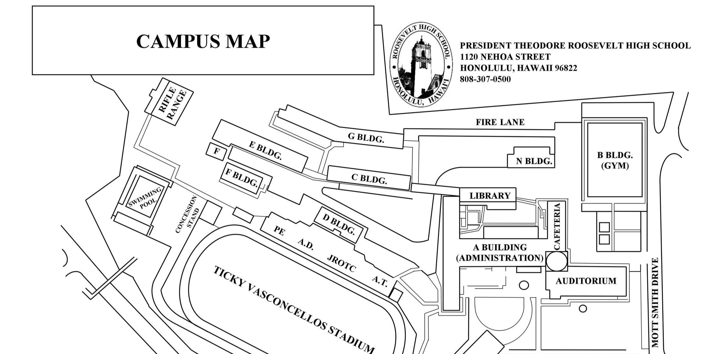
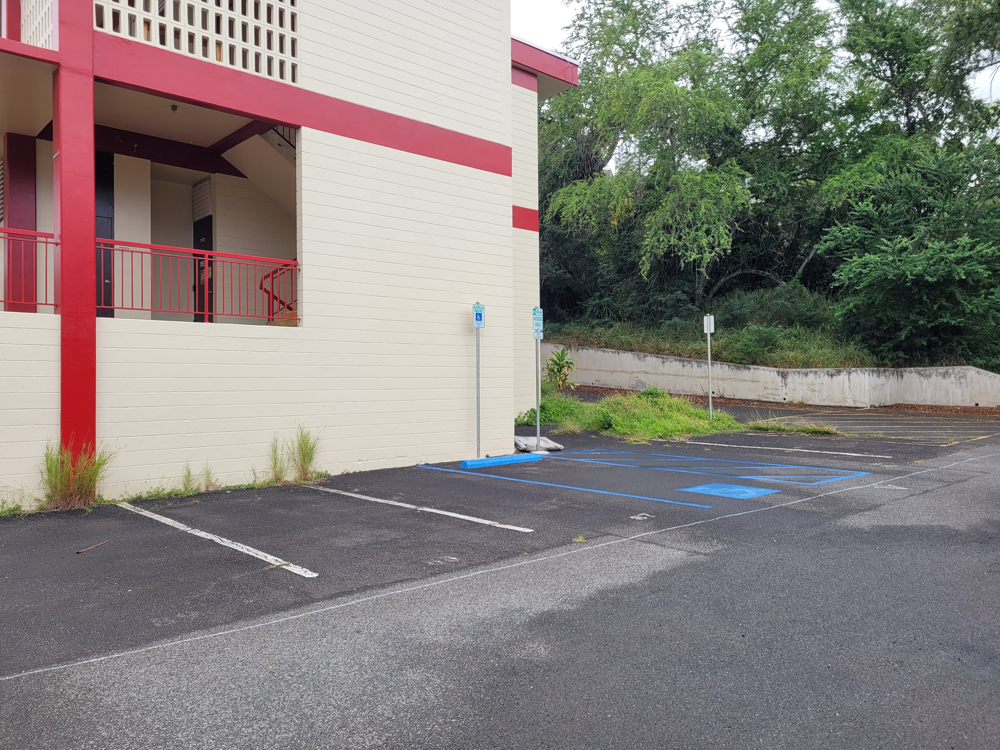
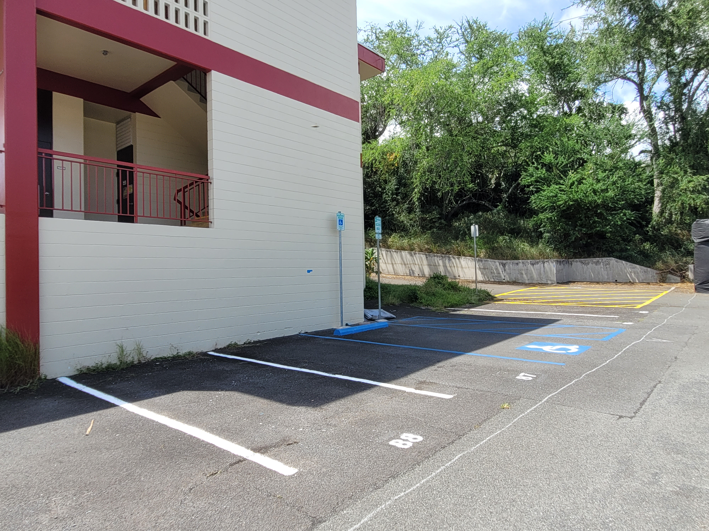
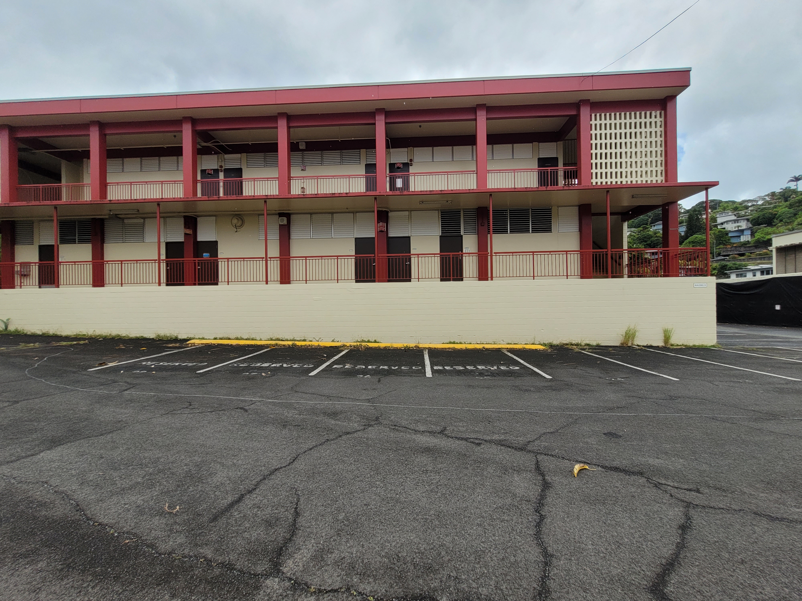
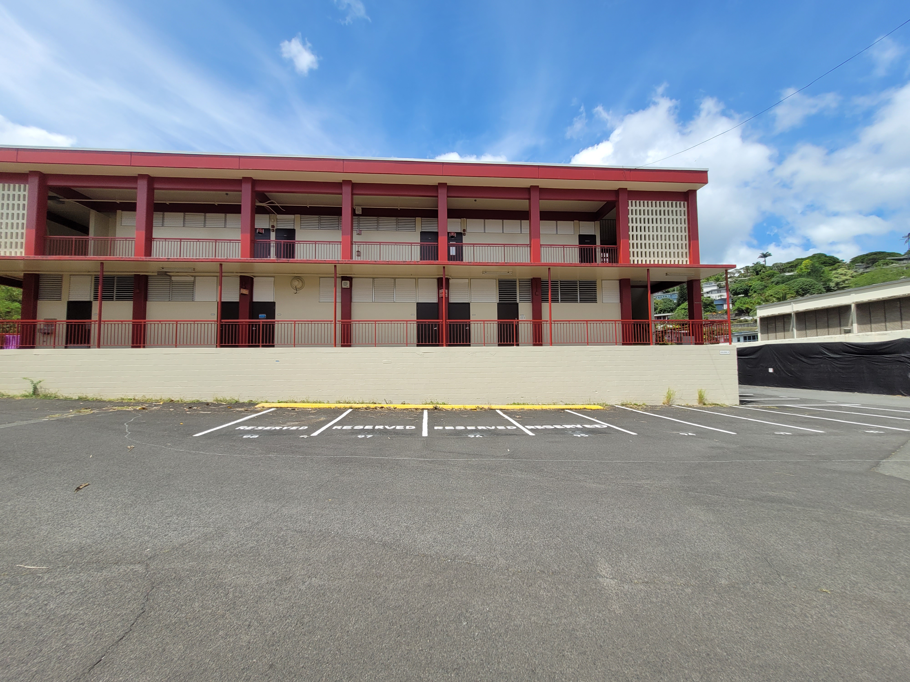

An Eagle Scout Service Project is the culmination of a Scout's efforts to earn the distinguished rank of Eagle Scout. Candidates must choose a non-profit beneficiary, meet with a representative to decide on a project, and formulate a proposal that is approved by both the beneficiary and Scouting America. Upon approval, the Scout must complete a detailed plan. This includes compiling a list of all required materials, tools, and supplies, estimating costs, identifying potential safety hazards, and creating a first aid plan. They must also manage project logistics, ranging from volunteer transportation and material acquisition to securing any necessary permits. Additionally, they must design a strategy for distributing volunteers across different tasks. Once this plan is complete, the Scout can finally fundraise, acquire materials, and recruit volunteers. On the day of execution, the Scout is responsible for coordinating the workforce and ensuring the project is carried out according to plan.

For my project, I chose President Theodore Roosevelt High School as my beneficiary and decided to repaint the school's parking lot. I met with the principal and head custodian to determine the scope of the project and prioritize the areas that needed the most attention. Using the information from these initial meetings, I drafted a proposal and submitted it to my local Scouting Council. After meeting with a representative and earning their approval, I worked with my beneficiary representatives to acquire the necessary paint, brushes, and rollers. I recruited volunteers, drew up plans to divide them into teams based on our outlined priorities, developed a safety plan, and coordinated food and refreshments. On the day of the project, I ran across campus delivering supplies, coordinating different groups, and directing them from one zone to the next, allowing us to complete our tasks far ahead of schedule.

Overall, this was a truly valuable experience that put my leadership abilities to the test. Communication is essential for any project to succeed, and coordinating between the beneficiaries and the volunteers heavily emphasized that reality for me. Large endeavors can only be achieved when everyone is not only putting in effort, but working cohesively toward specified goals. A leader must possess strong teamwork, communication, and planning skills, and there is a good reason why the Eagle Scout Service Project serves as the final milestone for anyone looking to earn the rank of Eagle Scout.

You can find some of the Before and After photos below:

<table class="text-center">
  <tr>
    <td></td>
    <td></td>
  </tr>
  <tr>
    <td></td>
    <td></td>
  </tr>
  <tr>
    <td></td>
    <td></td>
  </tr>
  <tr>
    <td></td>
    <td></td>
  </tr>
</table>