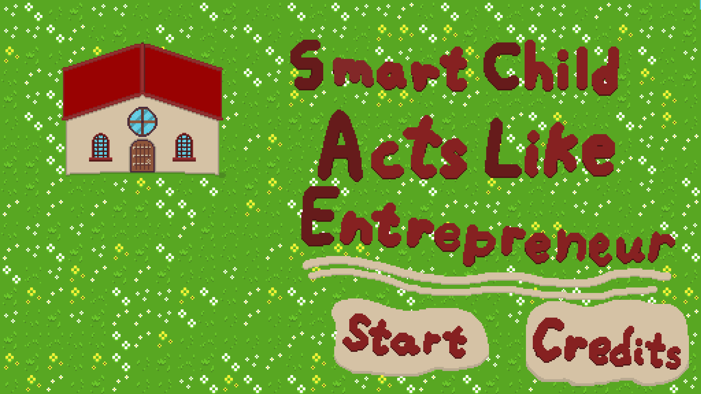
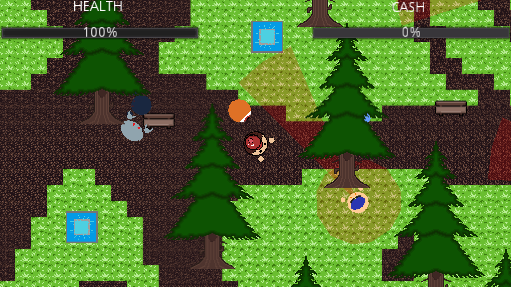

Smart Child Acts Like Entrepreneur (or S.C.A.L.E. for short) was a simple top-down action game I developed as a member of the Video Game Creation Club, which my friends and I founded during our senior year of high school. This was the second game we developed and published as a club. We utilized the open-source Godot engine for the gameplay and Aseprite to create our custom art assets. While a few of us had prior experience developing simple web games (see [Climbing a Mountain: The Game](https://tayten0.github.io/projects/mountain-game.html)), most of the club did not. Because our first project was much simpler, stepping up to this game was quite the learning experience. We built the game for the Game Off 2023 game jam on itch.io, basing our title and concept around the jam's official theme: "Scale." Given the tight three-week time constraint, the project proved challenging, but our game ultimately ranked 284th out of 611 entries.

For this project, I was part of the art department. As mentioned above, we used Aseprite to design our visual assets. Specifically, I was responsible for creating the player character sprites and the grass textures used for the level backgrounds.

Developing my previous web game opened my eyes to the process of game design, but S.C.A.L.E. was my first experience truly building a game from scratch. In contrast to my web game, which relied heavily on existing internet assets, almost everything in S.C.A.L.E. was made from the ground up (with the exception of a meme used for one of the in-game NPCs). We had a music team composing original tracks, an art team creating unique visuals, and a development team putting everything together. I learned a lot about the hurdles of full-cycle game development through this project. I'm incredibly proud that my friends and I were able to cap off our senior year with such a fun challenge, even if we did make the game as silly as possible.

The game remains available to play on itch.io. Keep in mind that the overall premise is highly lighthearted and comedic, as we developed it primarily as a joke. Click [here](https://vgcc.itch.io/smart-child-acts-like-entrepreneur) to be redirected to the game's store page. It can be played for free directly from your web browser, so no download is required.

 
Source: <a href="https://github.com/codingmannumber21/Gamecode">codingmannumber21/Gamecode</a>
